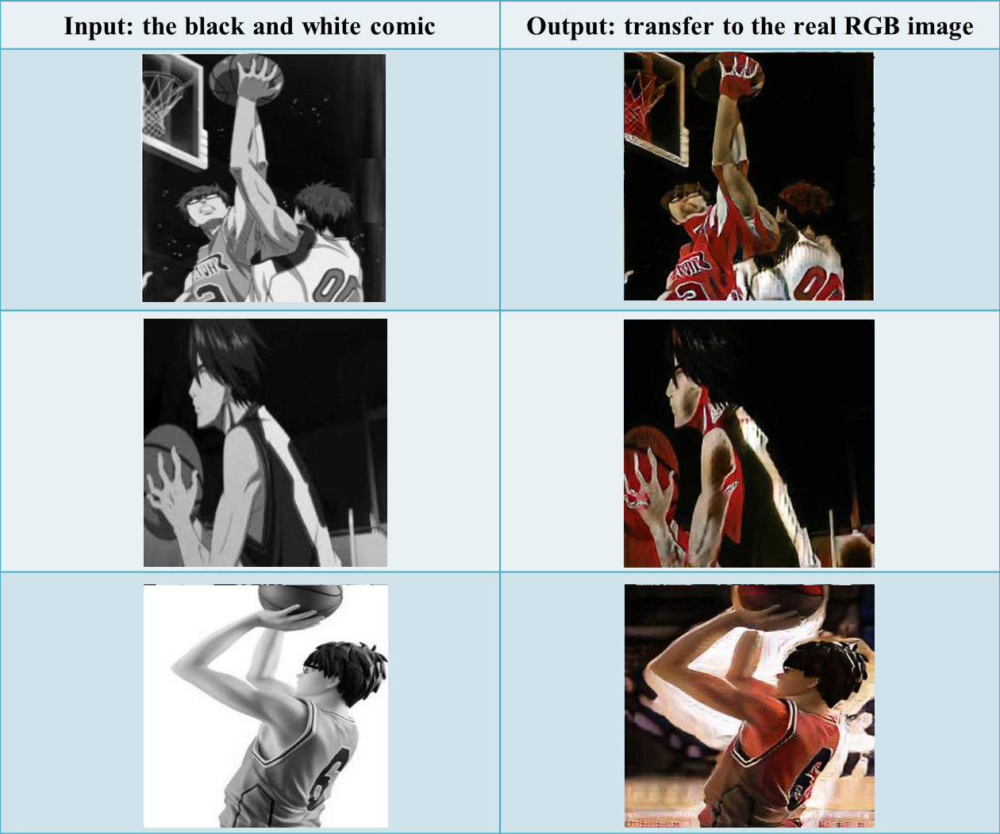

# Predicting-future-frames_cycleGAN
This is the TensorFlow implementation for CycleGAN. The code was written by [Harry Yang](https://www.harryyang.org) and [Nathan Silberman](https://github.com/nathansilberman).

CycleGAN: [[Project]](https://junyanz.github.io/CycleGAN/) [[Paper]](https://arxiv.org/pdf/1703.10593.pdf)  [[our reference]](https://github.com/4Catalyzer/cyclegan)

## Project overview
Our project aims to predict the future frames of the black and white comic.
Some previous methods using video frames and pixel flows to predict the next motion of the real image.
The state-of-the-art techniques in Generative Adversarial Networks such as CycleGAN is able to learn the mapping of one image domain to another image domain using unpaired image data.
Therefore, we hope to use two cycleGAN architecture to achieve our goal.
The first cycleGAN is to generate the real RGB image from the black and white comic.
Then we take this real RGB image as input and use another cycleGAN to predict the future frame.
Finally, we feed this future frame to the first cycleGAN to convert the style to black and white comic.

Below is our system overview:


## Current Process
Our project is divided into two parts.
First, we train one cycleGAN to convert black and white comic into real RGB images.
Second, we train the other cycleGAN to convert the current frame into the next frame.
For the first part, we limited the motion prediction to play basketball.
As the paper of cycleGAN mentions, the cycleGAN trained with horses and zebras does not perform well on the images which a man ride a horse.
Therefore, we speculated that if the cycleGAN was trained with mixed actions, the result would have been bad.
In order to improve the performance, we pick specific actions like playing basketball which means people are interacting with the ball in all the images.
Since there is no existing dataset with playing basketball, we have to collected our own dataset.
So far, we have had 1500 images for both black and white comic and real RGB data and trained the first cycleGAN.
We finished the training and tried to improve the performance of the first cycleGAN.  
For the second part, from the several basketball actions, we decide to predict shooting action.
We will collect the aiming action for trainA and shooting action for trainB.
Then, we are going to train the second cycleGAN with trainA and trainB.

## Dataset Collection
* For the first part: 
We select some real RGB images which are related to the basketball actions from ImageNet dataset, comic books and youtube video.
And we divide the image into two domains (trainA and trainB).
We search “sketch comic basketball” as keyword to obtain some parts of trainA domain.
In addition we use sketching program and edge detection methods to convert the real RGB images into Black and White comic images as some parts of trainA domain.

* For the second part:
We search two kinds of real RGB images (aim at the basket and shot the ball).
Some parts of images are from internet, our team choose manually.
And some parts of images, we cut continuous shooting basketball video into two actions.

## Implementation
### Prepare dataset
1. Put images into folders.
* Download the default CycleGAN dataset. (ex. horse2zebra)
```
bash ./download_dataset.sh horse2zebra
```
* Use your own dataset: Put images from each domain into `trainA` folder and `trainB` folder respectively.

2. Creating the training data *.csv file.
* Remember to modify the parameters in [`cyclegan_datasets.py`](https://github.com/nemocandy5/Predicting-future-frames_cycleGAN/blob/master/code/cyclegan_datasets.py). Such as the size and image type of each dataset. 
* Run create_cyclegan_dataset.py:
```
python create_cyclegan_dataset.py --image_path_a=./input/basketball/trainA --image_path_b=./input/basketball/trainB --dataset_name="basketball_train" --do_shuffle=0
```

### Training
1. Remember to modify the dataset name in configs/exp_01.json
2. Start training.
```
python main.py --to_train=1 --log_dir=./output/cyclegan/exp_01 --config_filename=./configs/exp_01.json
```
3. check the twnsorboard.
```
tensorboard --port=6006 --logdir=./output/cyclegan/exp_01/#timestamp#
```
4. If you want to fintune, restore in the previous model.
 ```
 python main.py --to_train=2 --log_dir=./output/cyclegan/exp_01 --config_filename=./configs/exp_01.json --checkpoint_dir=./output/cyclegan/exp_01/#timestamp#
 ```

### Testing
1. Creating the testing dataset: modify the parameters in [`cyclegan_datasets.py`](https://github.com/nemocandy5/Predicting-future-frames_cycleGAN/blob/master/code/cyclegan_datasets.py).
2. Creating the testing data *.csv file.
3. Start testing.
```
python main.py --to_train=0 --log_dir=./output/cyclegan/exp_01 --config_filename=./configs/exp_01_test.json --checkpoint_dir=./output/cyclegan/exp_01/#old_timestamp# 
```

## Current results
We finished the first part of training.
From the results, we can see that cycleGAN catches the contour of the main targets from black and white comic images.
However, it’s difficult to show the exact appearance of people in the generated images.  
We figured out some factors that might lead to such results.
First, the complexity of background will influence the sharpness of predictions.
Since the actions playing basketball are various and complicated, the contours of main targets for each images could be every different.
Hence, finding main targets could be a problem.
And if the background is full of noisy, cycleGAN would be hard to distinguish which is foreground and which is background.
Thus the foreground and the background are both blurry.
Second, the exaggeration of comic makes it hard to show the details after converting into real images.
The difference between comic and real images is that comic sometimes exaggerate or simplify the features and ignore the details.
Therefore, the cycleGAN has to learn to make up the details so that it can convert something simple into something complicated.
Third, silhouettes might be confused with background.
In the results, there are some generated images with white main target and colorful background which inputs are silhouettes.
It seems that the cycleGAN mistook the background as foreground. So it ignored the main target and focused on the background. 
To solve the problems mentioned above, we’re going to simplify the images we have.
We’ll make the backgrounds become simple to reduce the noisy and turn silhouettes into edges.
And then we’re going to find more data with simple contours to help the cycleGAN learn more details.

Below is our current results of the first cycleGAN:



